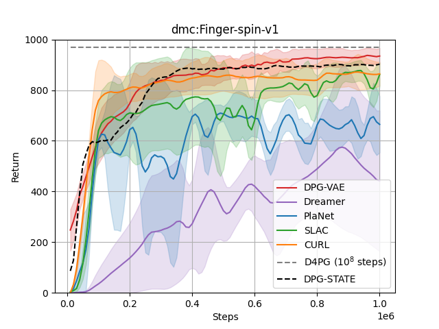

# DPG-VAE

This repository presents the implementation of

**Sample Efficient Reinforcement Learning from Visual Data with Modified Deep Deterministic Policy Gradient and Variational Autoencoder**

by [Rafat Rahman Tushar]() and [Shahnewaz Siddique]()

|[Paper]()| |[Video]()| 

## Results
Our DPG-VAE is evaluated on visual data received from various continuous control tasks of the DM-Control suite. We compared our evaluation results with various computationally intensive model-based and model-free methods. We represent our state-based low-dimensional model as DPG-STATE. DPG-STATE acts as an Oracle so that the upper bound for each task can be known. The evaluation results illustrate that DPG-VAE outperforms other state-of-the-art models on most of the tasks at various training steps.

  
  
  
  
  
  

